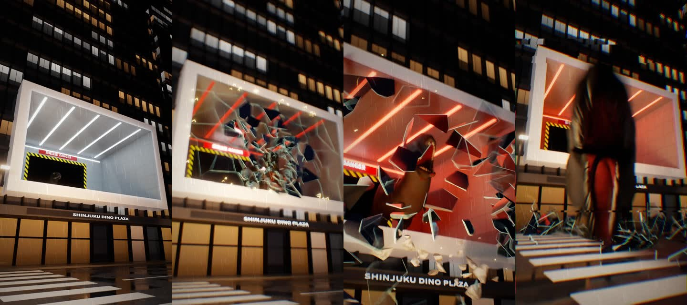

# 恐竜が飛び出す3D看板（Blender製VFX）

夜の街のビルにある「白い箱」型の3D看板から、T-Rexがガラスを突き破って飛び出し、カメラに噛みつく約14秒の縦動画（1080×1920）です。



- 完成動画: [`dino_billboard.mp4`](dino_billboard.mp4)（音つき）
- Blenderファイル: [`dino_billboard.blend`](dino_billboard.blend)（Blender 4.5 LTSで開けます。リグ付き恐竜・アニメーション・街・カメラ入り）

## 流れ（24fps）

| 秒 | 内容 |
|---|---|
| 0〜2 | 夜の街。看板の奥の暗いトンネルで目が光る |
| 2〜6.5 | T-Rexが歩いて出てくる（足音でカメラが揺れる） |
| 7 | 看板の中で咆哮 |
| 9 | 頭突きでガラスにヒビ、警報が赤く点滅 |
| 9.7 | ガラスが粉々に割れて飛び出す |
| 10.5 | 看板から身を乗り出して咆哮（クラッシュズーム） |
| 11〜12.3 | カメラに飛びかかり、口の中で暗転 |

## 作り方

素材はすべてプログラムで生成しています（外部の3Dモデル・写真・効果音は不使用）。

| ファイル | 役割 |
|---|---|
| `scripts/build_dino.py` | T-Rexの形をSDF（楕円体・円錐の合成）で作り、メッシュ化＋骨の重みを計算 |
| `scripts/dino_blender.py` | Blenderでメッシュ・リグ・皮膚/歯/目のマテリアルを作成 |
| `scripts/dino_anim.py` | 歩行（足のIK）・咆哮・頭突き・飛びかかりのアニメーション |
| `scripts/city.py` | 夜の街、ビル、ネオン看板、3D看板（白い枠＋箱の部屋） |
| `scripts/shatter.py` | ガラスのヒビ・破片（ボロノイ分割＋物理計算）、瓦礫、火花 |
| `scripts/make_scene.py` | 全部を組み立てて `.blend` を保存（タイミング調整・カメラの手ブレ） |
| `scripts/render.py` | Cycles（CPU）でEXR連番を書き出し |
| `scripts/post.py` | グロー、色調、雨、色収差、グレイン、1080×1920化 |
| `scripts/sound.py` | 足音・咆哮・ガラス・警報・環境音をすべて合成 |
| `scripts/finish.py` | 後処理＋音＋ffmpegでMP4に書き出し |

## 再現方法

```bash
# Blender 4.5 と ffmpeg、Python の numpy scipy scikit-image opencv-python-headless pillow OpenEXR が必要
# Blender側のPythonにも pillow と scipy を入れる:
#   <blenderのpython> -m pip install pillow scipy
cd dino-3d-billboard/scripts
BLENDER=/path/to/blender ./run_all.sh ../work
```

CPU 4コアで描画は1フレーム約25〜30秒（全302フレームで約2.5時間）です。
