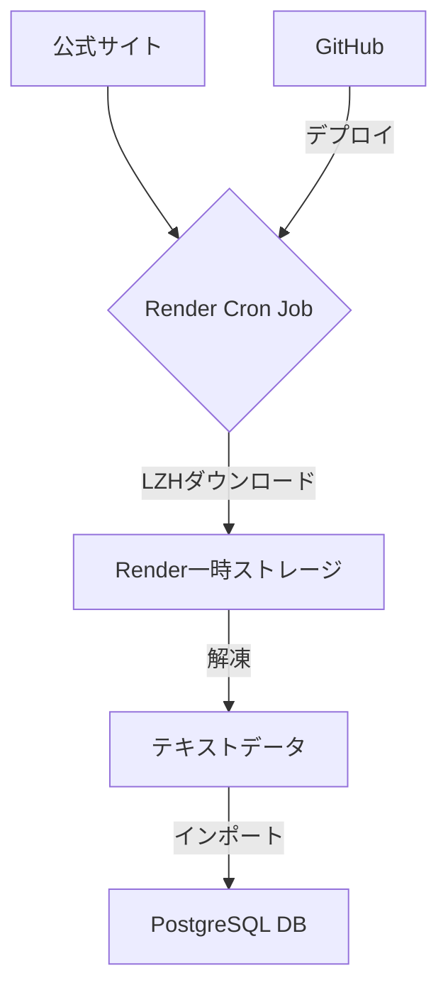

# 競艇予想AIプロジェクト システム仕様書

## 1. はじめに

本ドキュメントは、競艇予想AIプロジェクトのシステム全体像、特にデータフロー、データベース構造、デプロイ環境について記述するものです。過去に発生したような、既存データの再ダウンロードといった無駄な処理を防ぎ、今後の開発・運用を円滑に進めることを目的とします。

## 2. システム概要

本システムは、以下のコンポーネントで構成されています。

- **GitHub (`ai-auto-mailer`リポジトリ)**: データ収集・処理を行うPythonスクリプト群と、デプロイ設定（`render.yaml`）を管理します。
- **Render**: クラウドホスティングサービス。データベースのホスティングと、データ収集バッチ（Cron Job）の実行環境として利用します。
- **PostgreSQL (Render上)**: 収集した競艇の全データを格納するデータベースです。

### データ処理フロー

## 3. データベース仕様

### 3.1. 接続情報

- **サービス名**: `kokotomo-db-staging`
- **ホスト**: `dpg-d52du3nfte5s73d3ni6g-a.singapore-postgres.render.com`
- **データベース名**: `kokotomo_staging`
- **ユーザー名**: `kokotomo_staging_user`
- **備考**: 接続情報はRenderの環境変数 `DATABASE_URL` から取得されます。

> **重要**: 本プロジェクトでは**PostgreSQLに一本化**しています。Manus Space DB（TiDB）は使用しません。全てのデータはPostgreSQL（`kokotomo-db-staging`）に保存し、全てのサービスは`DATABASE_URL`環境変数を使用して接続します。

### 3.2. データ格納状況 (2026年1月20日時点)

調査の結果、主要な履歴データはすでにデータベースに格納済みであることが判明しています。しかし、一部データに欠損があります。

| テーブル名 | データ種別 | データ範囲 | 件数 | サイズ | 状態 |
|---|---|---|---|---|---|
| `historical_programs` | 番組表 (B) | 2005/01/01 〜 2026/01/19 | 6,396,827 | 1,745 MB | ✅ **完了** |
| `historical_race_results` | 競走結果 (K) | 2005/01/01 〜 2026/01/16 | 6,659,988 | 1,279 MB | ✅ **完了** |
| `historical_payoffs` | 払戻金 | 2020/08/08 〜 2022/09/30 | 921,165 | 192 MB | ⚠️ **不完全** |

**総括**: 番組表と競走結果は過去約20年分が完全にインポート済みです。一方で、払戻金データは大部分が欠損しています。

### 3.3. 主要テーブルスキーマ

#### `historical_programs` (番組表)

| カラム名 | 型 | 説明 |
|---|---|---|
| `id` | integer | 主キー |
| `race_date` | character varying(8) | レース開催日 (YYYYMMDD) |
| `stadium_code` | character varying(2) | 競艇場コード |
| `race_no` | character varying(2) | レース番号 |
| `boat_no` | character varying(1) | ボート番号 |
| `racer_no` | character varying(4) | 選手登録番号 |
| `racer_name` | character varying(20) | 選手名 |
| ... | ... | ... |

#### `historical_race_results` (競走結果)

| カラム名 | 型 | 説明 |
|---|---|---|
| `id` | integer | 主キー |
| `race_date` | character varying(8) | レース開催日 (YYYYMMDD) |
| `stadium_code` | character varying(2) | 競艇場コード |
| `race_no` | character varying(2) | レース番号 |
| `boat_no` | character varying(1) | ボート番号 |
| `rank` | character varying(2) | 着順 |
| ... | ... | ... |

#### `historical_payoffs` (払戻金)

| カラム名 | 型 | 説明 |
|---|---|---|
| `id` | integer | 主キー |
| `race_date` | character varying(8) | レース開催日 (YYYYMMDD) |
| `stadium_code` | character varying(2) | 競艇場コード |
| `race_no` | character varying(2) | レース番号 |
| `bet_type` | character varying(20) | 賭け式の種類 (3連単など) |
| `combination` | character varying(10) | 当選組み合わせ |
| `payout` | integer | 払戻金額 |
| ... | ... | ... |

### 3.4. 課題：無駄なダウンロード処理の原因

`boatrace-historical-import`バッチが、すでにDBに存在するデータを再ダウンロードする問題が発生していました。

- **原因**: バッチは `historical_import_progress` という進捗管理テーブルを参照して、未処理の月を判断していました。しかし、このテーブルが存在しない、またはリセットされていたため、全期間を「未処理」と誤認識し、ダウンロードを最初から実行していました。
- **現状**: `historical_programs` や `historical_race_results` テーブルにはすでに完全なデータが存在するため、このダウンロード処理は完全に無駄です。

## 4. Render 環境

### 4.1. サービス一覧

競艇プロジェクトでは、複数のサービスが稼働しています。

| サービス名 | タイプ | 役割 |
|---|---|---|
| `boatrace-historical-import` | Cron Job | 過去データのLZHファイルを一括でダウンロード・インポートする。**（現在停止中）** |
| `boatrace-daily-collection` | Cron Job | 日次の番組表・競走結果を収集する。 |
| `boatrace-result-collection` | Cron Job | リアルタイムでレース結果を収集する。 |
| `boatrace-odds-regular` | Cron Job | 定期的にオッズ情報を収集する。 |
| `boatrace-odds-high-freq-worker` | Background Worker | 高頻度でオッズ情報を収集する。 |
| `boatrace-dashboard` | Web Service | 開発用のダッシュボード（詳細不明）。 |
| `boatrace-daily-register` | Cron Job | 毎日23:00(UTC)に実行され、AIによる翌日の購入予定をDBに登録する。 |
| `kokotomo-db-staging` | PostgreSQL | プロジェクトのメインデータベース。 |

### 4.2. `boatrace-historical-import` の設定

- **実行コマンド**: `cd boatrace-collector/src && python import_historical_data.py all`
- **スケジュール**: 毎日 06:00 PM UTC (日本時間 03:00 AM)
- **環境変数**:
    - `DATABASE_URL`: DB接続情報
    - `MAX_MONTHS_PER_RUN`: 1回の実行で処理する最大月数
    - `TZ`: タイムゾーン (Asia/Tokyo)

## 5. 購入予定自動登録バッチ (`auto_betting.py`)

### 5.1. 概要

`boatrace-daily-register` という名称のCron JobとしてRender上で実行されるバッチ処理。AIの予測に基づき、翌日のレースの購入予定をデータベースに自動で登録することを目的とする。

- **実行コマンド**: `python auto_betting.py register`
- **スケジュール**: 毎日 11:00 PM UTC (日本時間 08:00 AM)
- **リポジトリパス**: `ai-auto-mailer/boatrace-dashboard/auto_betting.py`

### 5.2. 課題と修正内容

**課題**:
当初の実装では、本バッチはレース情報の収集を行わず、すでにデータベースに当日のレース情報が存在することを前提としていました。そのため、日次のレースデータ収集バッチ (`boatrace-daily-collection`) よりも先に本バッチが実行された場合、参照すべきレースデータが存在せず、処理が失敗するというタイミングの問題を抱えていました。システム時刻の変更などで一時的に問題を回避していましたが、根本的な解決には至っていませんでした。

**修正内容 (2026年1月21日実施)**:
この問題を根本的に解決するため、`auto_betting.py` の処理フローを以下のように修正しました。

1.  **レースデータの自己収集**: バッチの実行時、まず `pyjpboatrace` ライブラリを用いて当日の全レース情報を公式サイトから直接取得します。
2.  **データベースへの保存**: 取得したレース情報を `races` テーブルに保存（または更新）します。
3.  **購入予定の登録**: レース情報が確実にデータベースに存在することを確認した後、AIによる予測と購入予定の登録処理を実行します。

この修正により、`boatrace-daily-register` は他のバッチの実行順序に依存することなく、単体で安定して動作するようになりました。

---

## 6. GitHub リポジトリ (`ai-auto-mailer`)

- **リポジトリ**: `makoban/ai-auto-mailer`
- **主要ディレクトリ**: `boatrace-collector/`

### `boatrace-collector/` の構成

| パス | 説明 |
|---|---|
| `src/` | データ収集・インポートを行うPythonスクリプト群。`import_historical_data.py` などが含まれる。 |
| `render.yaml` | Renderサービスの構成ファイル（Blueprint）。Cron Jobのスケジュールや実行コマンドが定義されている。 |
| `schema/` | DBのスキーマ定義ファイル（一部）。 |

## 7. 提言と今後のアクションプラン

現状の課題を解決し、効率的な運用を実現するために、以下のアクションを提案します。

1.  **`boatrace-historical-import` バッチの恒久的な停止**
    - 履歴データはインポート済みのため、このバッチは不要です。Renderダッシュボードからサービスを削除またはSuspend状態に維持します。

2.  **払戻金データ（`historical_payoffs`）の補完**
    - 欠損している期間（2005年〜2019年、2023年〜現在）の払戻金データをインポートするための、**専用のワンタイムバッチスクリプト**を作成・実行します。
    - このスクリプトは、`historical_race_results`に存在するが`historical_payoffs`に存在しないレースを対象とすべきです。

3.  **進捗確認ロジックの修正**
    - 今後同様のバッチを作成する際は、`historical_import_progress`のような揮発性の高い進捗管理テーブルに依存しない設計を推奨します。
    - 代わりに、**ターゲットテーブル（例: `historical_race_results`）にデータが存在するかどうかを直接確認**し、存在しない場合のみインポート処理を行うように実装します。

以上の対応により、無駄なリソース消費を防ぎ、信頼性の高いデータ基盤を維持することができます。
