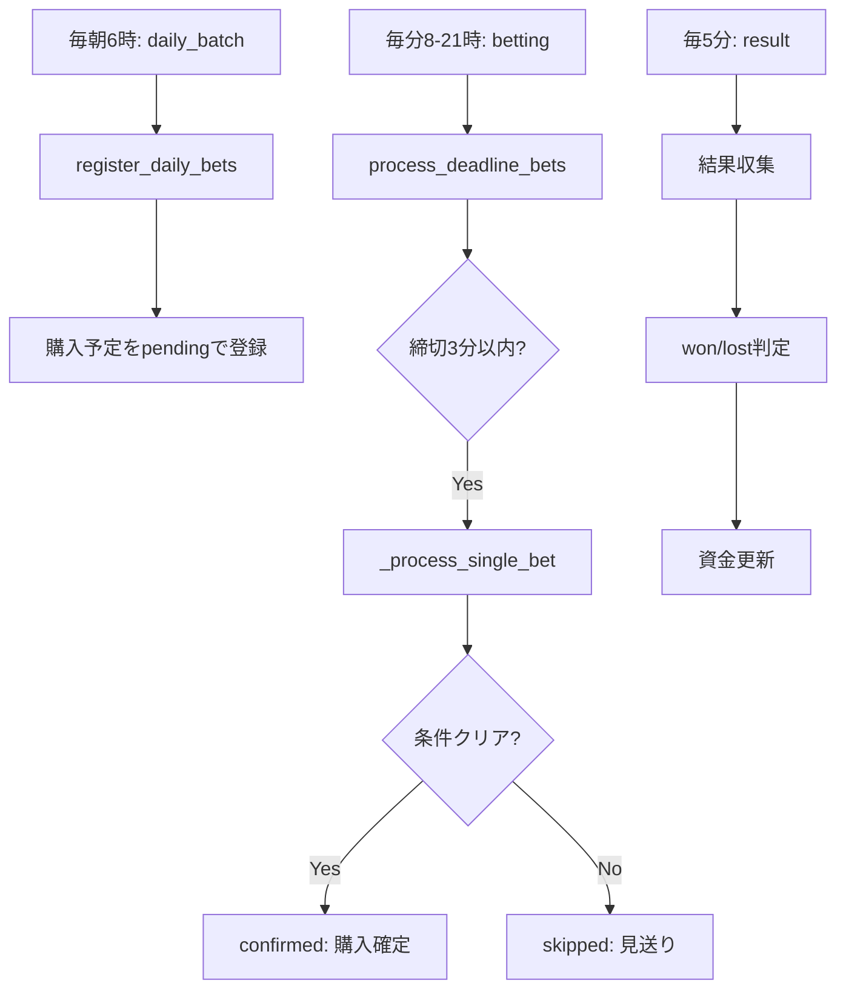

# 競艇仮想購入システム - 戦略仕様書

**バージョン**: v1.4
**作成日**: 2026-01-26
**運用開始日**: 2026-01-26

---

## 概要

本システムは2つの戦略を並行運用し、それぞれ独立した資金管理を行う。

| 戦略名 | キー名 | 初期資金 | 賭け金 |
|--------|--------|---------|--------|
| 3穴2nd戦略 | `bias_1_3_2nd` | ¥100,000 | ¥1,000/回 |
| １単勝10倍以上１－３ | `win_10x_1_3` | ¥100,000 | ¥1,000/回 |

---

## 戦略1: 3穴2nd戦略 (bias_1_3_2nd)

### 概要
- **買い目**: 1-3（1号艇-3号艇）
- **式別**: auto（2連単/2連複の高い方を自動選択）
- **期待ROI**: 106.6%

### 購入予定ロジック（毎朝6時実行）

```
条件1: 対象の競艇場×レース番号か？
  → 15パターン限定

条件2: 1号艇の当地勝率が4.5%以上6.0%未満か？
  → historical_programsから取得
```

**対象15パターン**:
| 会場 | レース番号 |
|------|-----------|
| 蒲郡 | 4R, 5R |
| 江戸川 | 4R |
| 平和島 | 4R |
| 津 | 4R |
| 三国 | 4R |
| 琵琶湖 | 4R |
| 住之江 | 5R |
| 鳴門 | 4R |
| 丸亀 | 4R |
| 徳山 | 4R |
| 下関 | 4R |
| 若松 | 4R |
| 芦屋 | 4R |
| 唐津 | 4R |

### 購入決定ロジック（締切3分前〜毎分実行）

```
1. 1号艇の当地勝率を再確認
   → 4.5% ≦ 勝率 < 6.0% でなければ見送り

2. 最新オッズを取得
   → 2連単(1-3)と2連複(1=3)の両方を取得

3. 高い方を選択
   → 2連単 ≧ 2連複 なら2連単を購入
   → 2連複 > 2連単 なら2連複を購入

4. オッズ範囲チェック
   → 3.0 ≦ オッズ ≦ 100.0 なら購入確定
   → 範囲外なら見送り
```

---

## 戦略2: １単勝10倍以上１－３ (win_10x_1_3)

### 概要
- **買い目**: 1-3（1号艇-3号艇）
- **式別**: 2連単固定
- **期待ROI**: 585.1%

### 購入予定ロジック（毎朝6時実行）

```
条件: 全レースが対象
  → 会場・レース番号の制限なし
  → オッズ条件は購入決定時に判断
```

### 購入決定ロジック（締切3分前〜毎分実行）

```
1. 1号艇の単勝オッズを取得
   → オッズ取得失敗なら見送り

2. 単勝オッズチェック
   → 単勝オッズ ≧ 10.0 なら購入確定
   → 単勝オッズ < 10.0 なら見送り

3. 1-3の2連単で購入
   → 式別は固定（autoではない）
```

---

## 共通アーキテクチャ

### 実行フロー



### データベーステーブル

| テーブル | 用途 |
|----------|------|
| `virtual_bets` | 購入予定・結果 |
| `virtual_funds` | 戦略別資金状況 |
| `races` | レース情報 |
| `historical_programs` | 当地勝率データ |
| `odds_history` | オッズ履歴 |
| `payoffs` | 払戻金データ |

### ステータス遷移

```
pending（購入予定）
    ↓
confirmed（購入確定）または skipped（見送り）
    ↓
won（的中）または lost（不的中）
```

---

## ファイル構成

| ファイル | 役割 |
|----------|------|
| `virtual_betting.py` | 戦略定義・購入ロジック |
| `cron_jobs.py` | 定期実行ジョブ |
| `api.py` | ダッシュボードAPI |
| `index.html` | ダッシュボードUI |

---

## 見送り理由一覧

| 理由 | 説明 |
|------|------|
| 当地勝率取得失敗 | 選手データが取得できない |
| 当地勝率範囲外 | 4.5-6.0%の範囲外 |
| オッズ取得失敗 | オッズデータが取得できない |
| オッズが低すぎる | 最低オッズ条件未達 |
| オッズが高すぎる | 最高オッズ条件超過 |
| 1号艇単勝オッズ不足 | 10倍未満（win_10x_1_3） |
| 締切超過 | 購入判断が間に合わなかった |
